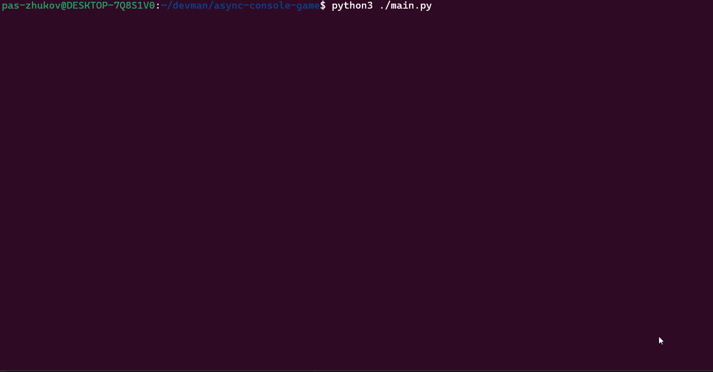

# Консольная игра "Star Ship"

Игра на собственном асинхронном движке. 




На данный момент реализована отрисовка звёздного неба и космического корабля. Кораблём можно управлять при помощи стрелок на клавиатуре.

## Как развернуть на локальной машине

Для работы скрипта на вашем компьютере должен быть установлен интерпретатор [Python 3.10 или старше](https://www.python.org/downloads/).
Установка сторонних библиотек не требуется.

Первым делом, скачайте код:
``` 
git clone https://github.com/alexnv/27-dvmn-async-spacegame.git
```

Запустите игру командой:

```shell
python main.py
```

Для выхода используйте сочетание клавиш Ctrl+C.

## Цель проекта:

Код написан в учебных целях.